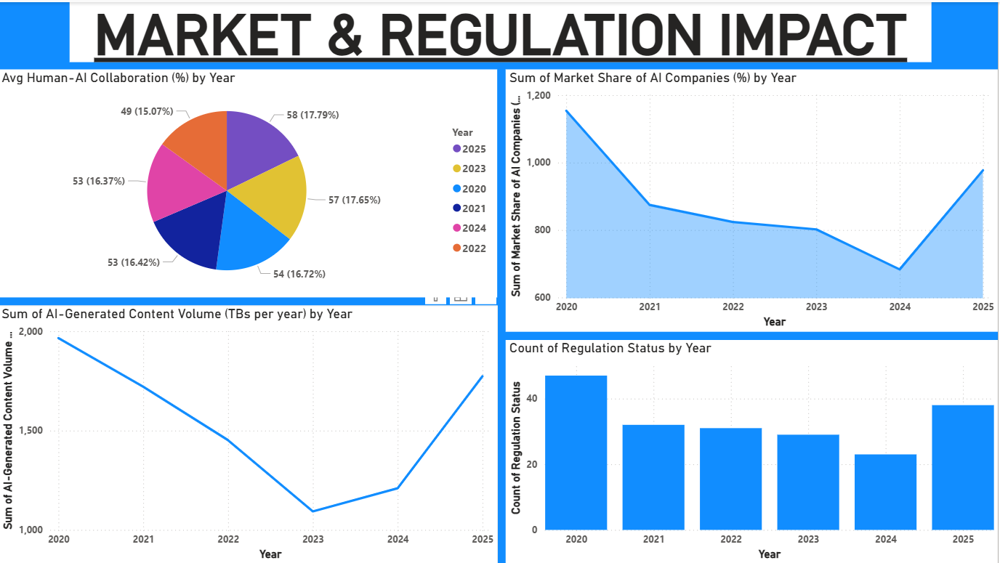

# AI-Impact-on-Jobs-2020-25
End-to-end Data Analytics &amp; ML project analyzing AI impact on jobs, revenue, trust, and regulation using Python and Power BI.

This project analyzes the impact of Artificial Intelligence on jobs, revenue growth, consumer trust, and regulations across industries between 2020–2025.

## Objectives
- Analyze AI adoption trends across industries
- Study job loss and revenue impact due to AI
- Understand human–AI collaboration and consumer trust
- Visualize insights using interactive dashboards

## Tools & Technologies
- Python (Pandas, NumPy, Matplotlib, Seaborn)
- Machine Learning (Linear Regression)
- Power BI (DAX, Interactive Dashboards)

## Key Insights
- AI adoption and revenue growth increased steadily across industries
- Job loss due to AI varies significantly by industry
- Human–AI collaboration is improving over time
- Regulatory activity increased as AI adoption grew

## 📊 Power BI Dashboard Pages

### Dashboard – Page 1

### Dashboard – Page 2

### Dashboard – Page 3

